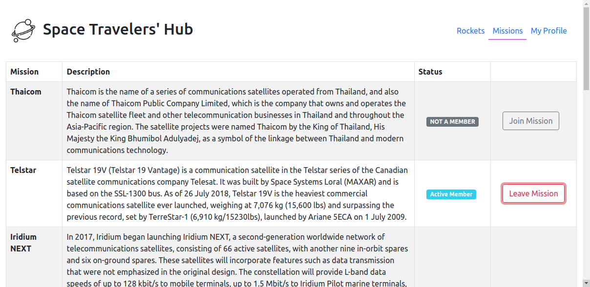
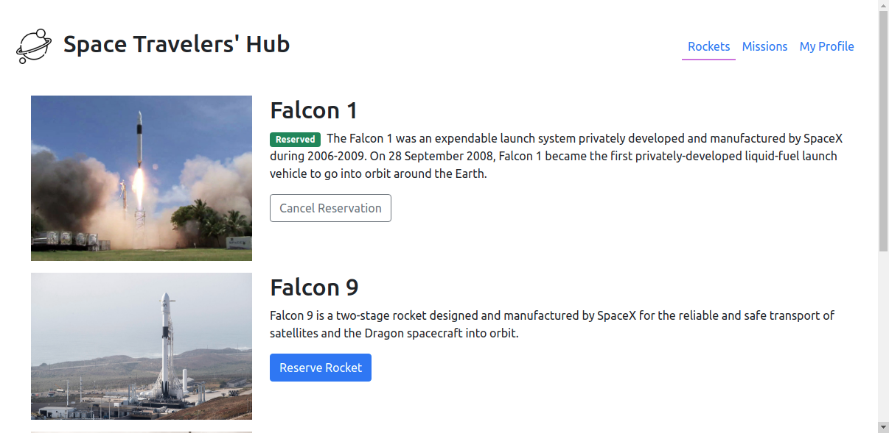

# Space-travelers-hub
This is a React web application for a company that provides commercial and scientific space travel services. 





Additional description of the project and its features.

## 🔴  Live Demo

[Space-travelers-hub](https://eloquent-northcutt-7089a4.netlify.app)

## Project Overview Video

[Watch Here](https://youtu.be/QapepoQ7vKg)

## Built With

- HTML
- CSS
- React
- Redux

## Getting Started

To get a local copy up and running follow these simple steps inside the root folder.

### Setup

Install dependencies with:

```
npm install
```

### Usage

Start server with:

```
npm start
```

it will open `http://localhost:3000/` in your default browser.

## Authors

👤 **Donat UWAMAHORO**

- Github: [Donat Uwamahoro](https://github.com/uwadonat)
- Linkedin: [Donat Uwamahoro](https://www.linkedin.com/in/uwadonat)
- Twitter: [Donat Uwamahoro](https://twitter.com/uwahoroDonat)

👤 **Stephan**

Github: [@sneeu-leeu](https://github.com/sneeu-leeu)

Twitter: [@Stephan07484055](https://twitter.com/Stephan07484055)

LinkedIn: [Stephan Annandale](https://www.linkedin.com/in/stephan-annandale-a4b4931a9/)

## 🤝 Contributing

Contributions, issues and feature requests are welcome!

Feel free to check the [issues page]().

## Show your support

Give a ⭐️ if you like this project!

## Acknowledgments

- Microverse

## 📝 License

This project is MIT Lisenced
